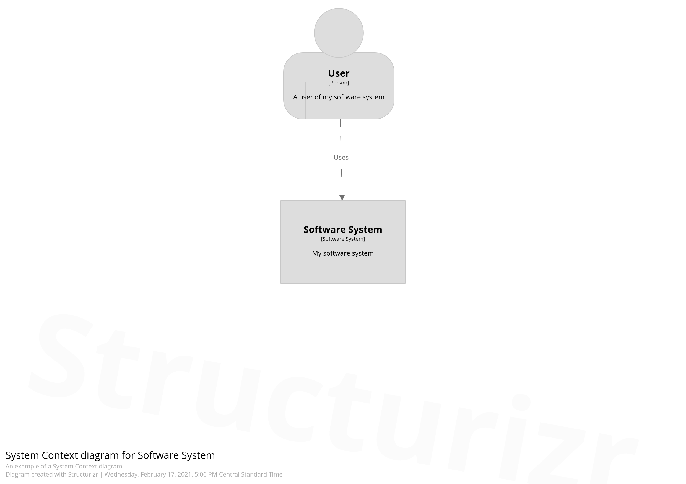
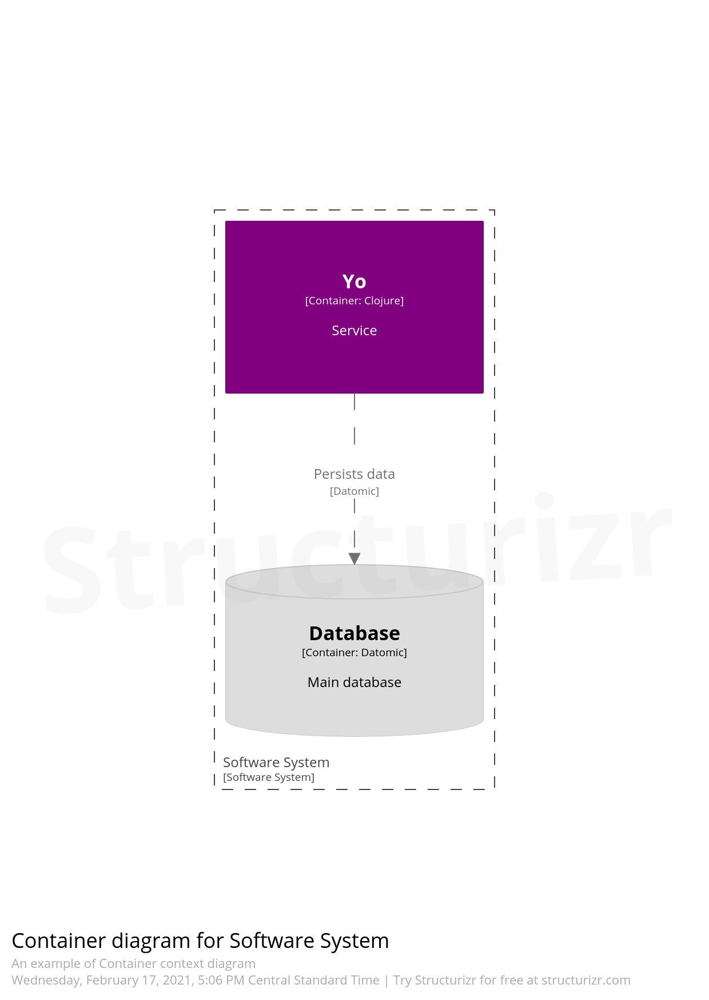

# Structurizr for Clojure

[](https://clojars.org/structurizr-clj)

A Clojure library designed to generate software architecture models based upon the C4 model, it uses the [Structurizr Java library](https://github.com/structurizr/java) under the hood. In other words is a wrapper with the most common functions used in the Java library with some syntax sugar macros to better structure the diagram code in a Clojure style.

Go to the [Structurizr documentation](https://github.com/structurizr/java#table-of-contents) to understand the C4 model and the concepts behind structurizr (workspaces, model and views).

_(This is a libary in alpha version, it's very likely to change)_

## Example

``` clojure

(ns diagram-example
  (:require [structurizr-clj.core :refer [defmodel defstyles defviews defworkspace] :as structurizr]
            [structurizr-clj.shape :as structurizr.shape]
            [structurizr-clj.tags :as structurizr.tags]))

(defworkspace example
  [workspace (structurizr/new-workspace "Getting Started" "This is a model of my software system")]
  (defmodel [model           (structurizr/model workspace)
             user            (structurizr/add-person model "User" "A user of my software system" [structurizr.tags/person])
             software-system (structurizr/add-software-system model "Software System" "My software system")]
            [yo-service (structurizr/add-container software-system "Yo" "Service" "Clojure" ["Main"])
             database   (structurizr/add-container software-system "Database" "Main database" "Datomic" ["Database"])]
            []
    (structurizr/uses user software-system "Uses")
    (structurizr/uses yo-service database "Persists data" "Datomic")
    (defviews [views                (structurizr/views workspace)
               containers-view      (structurizr/create-container-view views software-system "Containers" "An example of Container context diagram")
               software-system-view (structurizr/create-system-context-view views software-system "System Context" "An example of a System Context diagram")]
      (defstyles [styles (structurizr/styles views)]
        (doto (structurizr/add-element-style styles structurizr.tags/person)
              (structurizr/shape structurizr.shape/person))
        (doto (structurizr/add-element-style styles "Database")
              (structurizr/shape structurizr.shape/cylinder))
        (doto (structurizr/add-element-style styles "Main")
              (structurizr/background "#800080")
              (structurizr/color "#ffffff")))
      (doto software-system-view
            structurizr/add-all-software-systems
            structurizr/add-all-people)
      (doto containers-view
            structurizr/add-all-software-systems
            structurizr/add-all-containers))))
```

<p align="center">
 
 
</p>

## Render Workspace

Structurizr Java supports renders to plantUML, Mermaid and publish the workspace to the structurizr cloud or on-premise server. This libary supports the three of them, shown below.

### Publish workspace

``` clojure

(defn publish-workspace [workspace]
  (let [api-key      "SOME-API-KEY"
        api-secret   "SOME-API-SECRET"
        client       (structurizr/client api-key api-secret)
        workspace-id 1234]
    (structurizr/publish-workspace client workspace-id workspace)))
    
;; Using the example workspace

(publish-workspace example)
```

### Mermaid

``` clojure
(ns render-example
  (:require [structurizr-clj.core :refer [defmodel defviews defworkspace] :as structurizr]
            [structurizr-clj.render :as render]))

;; Asuming an example workspace is define
(def views (structurizr/views example))

;; There might be many system contex views define, in this case it takes the first one
(def system-context-view (first (render/system-context-views views))) 

(render/mermaid system-context-view) ;; Returns the string mermaid code
(render/mermaid-writer system-context-view "path/mermaid.txt") ;; Writes a file with the mermaid code to the given path

```

### PlantUML

``` clojure
(ns render-example
  (:require [structurizr-clj.core :refer [defmodel defviews defworkspace] :as structurizr]
            [structurizr-clj.render :as render]))

;; Asuming an example workspace is define
(def views (structurizr/views example))

;; There might be many system contex views define, in this case it takes the first one
(def system-context-view (first (render/system-context-views views))) 

(render/plantuml system-context-view) ;; Returns the string plantuml code
(render/plantuml-writer system-context-view "path/plantuml.txt") ;; Writes a file with the plantuml code to the given path

```

## License

Copyright © 2021 FIXME

This program and the accompanying materials are made available under the
terms of the Eclipse Public License 2.0 which is available at
http://www.eclipse.org/legal/epl-2.0.

This Source Code may also be made available under the following Secondary
Licenses when the conditions for such availability set forth in the Eclipse
Public License, v. 2.0 are satisfied: GNU General Public License as published by
the Free Software Foundation, either version 2 of the License, or (at your
option) any later version, with the GNU Classpath Exception which is available
at https://www.gnu.org/software/classpath/license.html.
